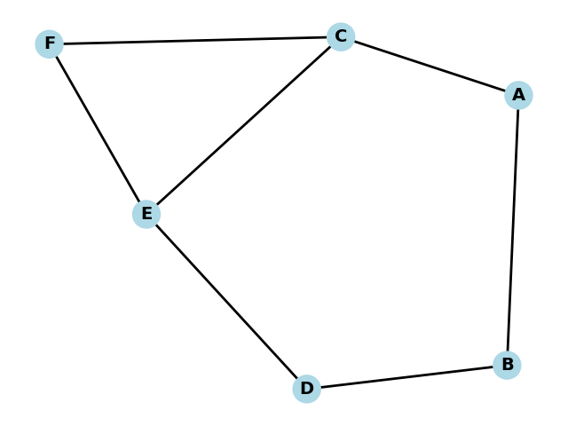
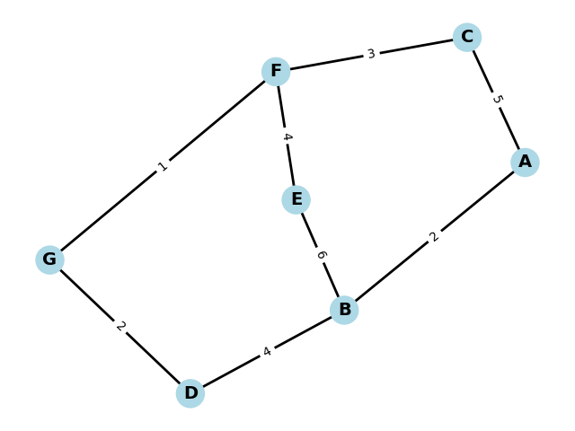

## AFL-3
1. Graf Tak Berarah, Derajat

V = {A, B, C, D, E, F}

E = {(A, B),(A, C),(B, D),(C, E),(D, E),(E, F),(C, F)}

a. 

b. 
```txt
============================================================
                     GRAPH DEGREE ANALYSIS
============================================================

Graph Type: UNDIRECTED

Node       Degree
------------------------------------------------------------
A          2
B          2
C          3
D          2
E          3
F          2

Highest Degree: C (3)
======================================================================
```


3. BFS, DFS, Dijkstra

V = {A, B, C, D, E, F, G}

E = {(A, B, 2), (A, C, 5), (B, D, 4), (B, E, 6), (C, F, 3),(D, G, 2),(E, F, 4),(F, G, 1)}

a. 

b. 
```txt
--- BFS Traversal Details ---
Starting node: A
Target node: F

Visiting nodes in order:
Step 1: Visit A (start node)

Exploring from A, neighbors: ['B', 'C']
Step 2: Visit B (from A)
Step 3: Visit C (from A)

Exploring from B, neighbors: ['A', 'D', 'E']
Step 4: Visit D (from B)
Step 5: Visit E (from B)

Exploring from C, neighbors: ['A', 'F']
Step 6: Visit F (from C)

✓ Target node F found!
Total nodes visited: 6
Nodes visited in order: A -> B -> C -> D -> E -> F
BFS path from A to F: A -> C -> F
Number of steps: 2
```

c. 
```txt
--- DFS Traversal Details ---
Starting node: A
Target node: F

Visiting nodes in order:
Step 1: Visit A
  Exploring from A, unvisited neighbors: ['B', 'C']
Step 2: Visit B
  Exploring from B, unvisited neighbors: ['D', 'E']
Step 3: Visit D
  Exploring from D, unvisited neighbors: ['G']
Step 4: Visit G
  Exploring from G, unvisited neighbors: ['F']
Step 5: Visit F

✓ Target node F found!
Total nodes visited: 5
Nodes visited in order: A -> B -> D -> G -> F
DFS path from F to F: A -> B -> D -> G -> F
Number of steps: 4
```

d. 
```txt
Dijkstra's Algorithm Table (Start: A, End: F)
================================================================================
Step  Current   Visited        A       B       C       D       E       F       G       
--------------------------------------------------------------------------------
1     A         {A}            0       ∞       ∞       ∞       ∞       ∞       ∞       
2     A         {A}            0       2       5       ∞       ∞       ∞       ∞       
3     B         {A, B}         0       2       5       6       8       ∞       ∞       
4     C         {A, B, C}      0       2       5       6       8       8       ∞
5     D         {A, B, C, D}   0       2       5       6       8       8       8
================================================================================
Shortest path from A to F: A -> C -> F
Total distance: 8
```