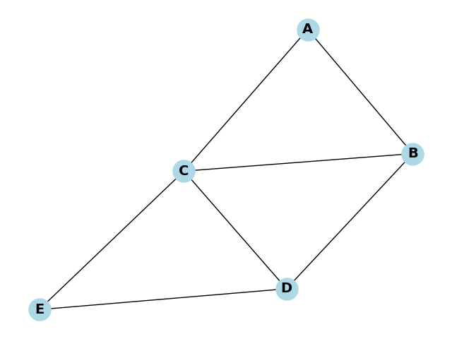
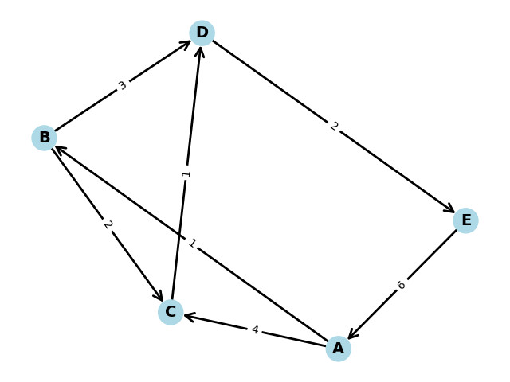

# Graph Theory with Python


Contributors:
- [Patrick Shiawase Aruji](https://github.com/shiawasepat)
- [Fernandes Howard](https://github.com/Nandes012)
- [Michael Vergo](https://github.com/Mifey05)


The program consists 3 methods of Graph Theory such as **Breadth-First Search (BFS)**, **Depth-First Search (DFS)**, as well as **Dijkstra's Algorithm**. The user will be prompted to choose from the three with the desired nodes and weight.

Node A 'til E is already encoded in the program, feel free to either add or modify the connections between the nodes and the weight of the connections.  

The user can also choose whether if they want the connections to be directed or not, this will pop up first if you run the program. The graph will set as **`Undirected Graph`** if the user did not input the corresponding number or anything.

## Graph Analysis Menu

The sample below will display the user how they want their graph to be displayed.
```txt
=== (DIRECTED / UNDIRECTED) GRAPH ANALYSIS MENU ===
1. Display Graph (basic)
2. Display Weighted Graph
3. Find Shortest Path (Dijkstra)
4. Additional Methods
5. Switch Graph Type
6. Exit
```


## Methods

Below are available methods based on their order from the program.

1. Plain Graph (Undirected)


2. Plain Graph with Weights (Directed)


3. Dijkstra's Algorithm
```txt
Choose output type (1-3): 2
Shortest path from A to E: A -> B -> E
Total distance: 6
```

### Additional Methods
This can be accessed when `4. Additional Methods` (typing 4 on the terminal) is selected and shows 3 additional methods 

1. Dijkstra's Algorithm (with Table):

*This method can be found when entering the `additional_methods` sub-menu*

```txt
Dijkstra's Algorithm Table (Start: A, End: E)
================================================================================
Step  Current   Visited        A       B       C       D       E
--------------------------------------------------------------------------------
1     A         {A}            0       ∞       ∞       ∞       ∞
2     A         {A}            0       1       4       ∞       ∞
3     B         {A, B}         0       1       3       4       6
================================================================================
Shortest path from A to E: A -> B -> E
Total distance: 6
```

This table format provides an easier way to visualize Dijkstra's Algorithm by showing how distances are updated at each step.


2. BFS Algorithm


3. DFS Algorithm


